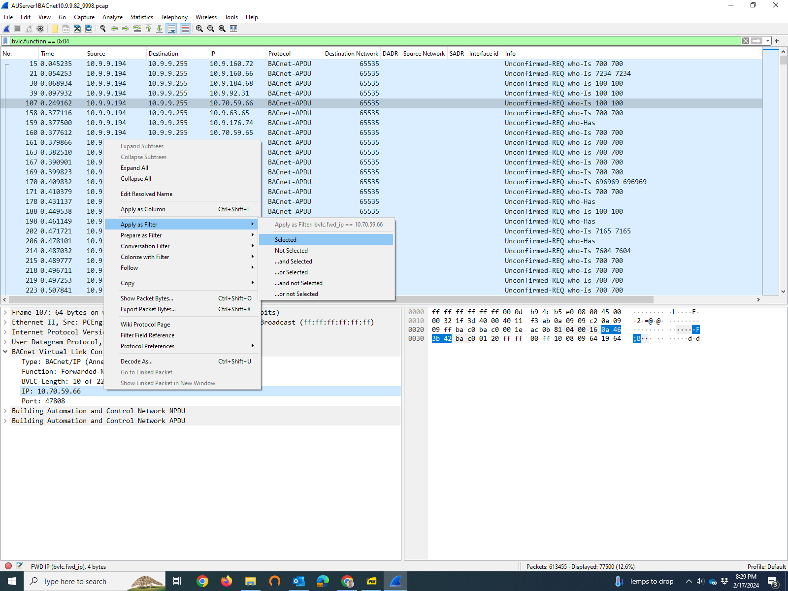

# BACnet Packet Capture and Analysis
Packet capture and analysis can be used to diagnose problems related to BACnet communication, including BACnet network segmentation.  The Wireshark application is often used for diagnosis, and it can also be used for packet capture in some circumstances.

## Packet Capture
Cimetrics BACnet Network Segmentation Devices (BNSD) include a BACnet packet capture agent that can be enabled by the device's administrator.  This packet capture agent produces Wireshark-compatible files. For Cimetrics products with multiple physical Ethernet network ports, this packet capture agent will capture BACnet network traffice on all physical ports simultaneously and label each packet with the numerical ID of the network port from which the packet was captured, typically 0 or 1 (see "frame.interface_id" in Wireshark).

Wireshark can be used to capture packets on a computer where Wireshark is installed.  This is most useful when the computer is actively communicating using BACnet.  If Wireshark is running on a computer that is not actively communicating using BACnet, it will most likely see only BACnet broadcast messages if the computer is connected to an Ethernet switch.  Port mirroring can be enabled on many Ethernet switches in order to enable packet capture of traffic received and sent by a device that cannot run Wireshark or another packet capture agent.

Some networks have a substantial amount of uninteresting network traffic, which can substantially increase the size of packet capture files.  When an application like Wireshark is used for packet capture, it is often useful to restrict the traffic that goes into the packet capture file.  An example of a Wireshark capture filter that would be useful for many BACnet/IP networks would be `udp port 47808`, which restricts the captured traffic to UDP datagrams on port 47808 (the default port for BACnet/IP).

The packet capture agent built into Cimetrics BNSDs blocks almost all non-BACnet/IP traffic.  Note that BNSDs that support BACnet/SC are also capable of capturing BACnet/SC messages, but session keys must be used in order to decrypt the BACnet/SC messages; see the BNSD product documentation for details.

Sometimes it is difficult to observe a particular situation using packet capture because it is rare in normal operation.  In such cases it may be useful to send specific BACnet messages while doing packet capture in order to observe how BACnet devices react.  For that purpose, a software tool like Cimetrics's BACnet Explorer is recommended.

## Network Traffic Analysis and Problem Diagnosis using Wireshark
Wireshark is the most commonly used tool for BACnet network traffic analysis, because it supports a variety of packet capture file formats and because it has a good BACnet message decoder.  To use Wireshark effectively, you should become familiar with Wireshark's display filter syntax, Wireshark's text-based packet search, and BACnet's network packet structure. 

### Wireshark Display Configuration
Wireshark's default display has three window panes: a packet list on top (one packet per line), the decoding of the selected packet on the lower left, and the raw contents of the packet on lower right.  The packet list shows selected packet fields, and the set of displayed packet fields can (and should) be modified as appropriate for the specific analysis being performed. 
 The options for configuring the display are too numerous to describe here, so please consult the [Wireshark User's Guide](https://www.wireshark.org/docs/wsug_html/) for additional information.

### Wireshark Display Filters
Display filtering enables you to display a subset of the already captured network packets based on the contents of the packet.  It is particularly useful because the filter language allows you to focus on the values of specific fields within a packet.  General information about Wireshark display filtering is [here](https://wiki.wireshark.org/DisplayFilters), and BACnet-specific information is [here](https://wiki.wireshark.org/Protocols/bacnet).

Probably the simplest display filter is one that requires that displayed packets contain a specified packet layer.  If you are only interested in displaying BACnet/IP packets, then the display filter `bvlc` (referring to the BACnet Virtual Link Control layer) will usually do what you want.  Other display filters for specific BACnet packet layers are 'bacnet' (referring to BACnet's network layer) and 'bacapp' (referring to BACnet's application layer).

Frequently we are only interested in displaying packets that contain a particular field.  A display filter that requires that displayed packets contain a specific field within a specific packet layer will have the following structure: `layer.field`, for example, `bacnet.dnet`.

It is often useful to also specify a value or a range of values for a specified field.  A simple display filter of this type is has the following structure: `layer.field==value`.  Note that "==" in a display filter means a test for equality, so the packets that will be displayed are those for which the specified field present and its value is equal to the specified value.  For example, if you want to view only the BACnet messages that were originally sent by devices connected to (remote) BACnet network 888, this simple display filter will accomplish that: `bacnet.snet==888`.  If you want to view messages that were received from any device with an IP address on subnet 192.168.1.0/24, the following display filter will suffice: `ip.src_host==192.168.1.0/24`

By contrast, "!=" means that the left side and the right side must not be equal.  For example, `bacnet.snet!=7191` will select only the packets that contain the SNET field in the BACnet NPDU layer as long as that field's value is not 7191.  There are several other comparison operators, including ">" (greater than) and "<" (less than); see [this web page](https://wiki.wireshark.org/DisplayFilters) for a more complete description of the comparison operators.

Another example: If you want to view only the BACnet Who-Is messages, this display filter will work:
`bacapp.unconfirmed_service == 8`.  Who-Is is an unconfirmed service in BACnet's application layer, and the value 8 specifies the Who-Is service.  Changing the value to 0 specifies the I-Am service: `bacapp.unconfirmed_service == 0`.  The values for each of the unconfirmed services are enumerated in the [BACnet standard](https://ashrae.iwrapper.com/ASHRAE_PREVIEW_ONLY_STANDARDS/STD_135_2020) (search for "BACnetUnconfirmedServiceChoice" in clause 21.3).

BACnet's application layer also has confirmed services, such as the widely used ReadProperty and ReadPropertyMultiple services.  The following display filter will select only ReadProperty requests and responses to ReadProperty requests: `bacapp.confirmed_service == 12`.  The value 12 specifies the ReadProperty service.  The values for each of the confirmed services are enumerated in the [BACnet standard](https://ashrae.iwrapper.com/ASHRAE_PREVIEW_ONLY_STANDARDS/STD_135_2020) (search for "BACnetConfirmedServiceChoice" in clause 21.2).

We can combine simple filters using the "and" and "or" logical operators to create more complex filters.  The "not" logical operator is also supported.  For example, the display filter `bacnet.snet==888 and bacapp.unconfirmed_service == 8` means that only packets matching both the source network number (888) and the specified unconfirmed service (8, meaning Who-Is) will be displayed.  

Parentheses may be used in order to control the order that the logical operators are applied.  For example, `(bacnet.snet==7191 or bacnet.dnet==7191) and bacapp.unconfirmed_service == 8` has a different meaning from `bacnet.snet==7191 or (bacnet.dnet==7191 and bacapp.unconfirmed_service == 8)`.

But how do you identify the appropriate packet components to create the desired display filter?  One way to do this is to locate one packet that has some of the desired characteristic(s), and then in the window pane showing the decoded packet, right click on a field that contains information that should be part of the diaplay filter.  Next, select either "Apply as filter" (to apply the filter to the packets immediately) or "Prepare as filter".  See the screenshot below.

